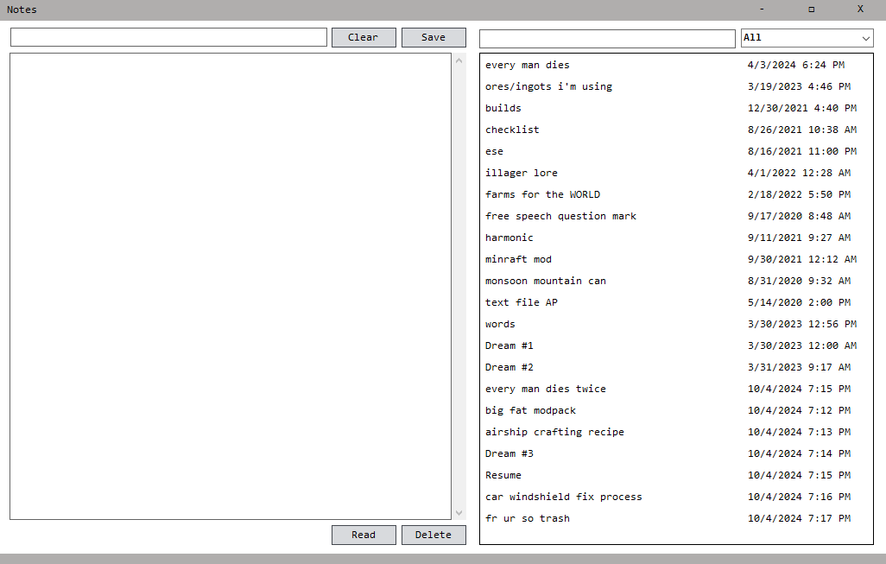
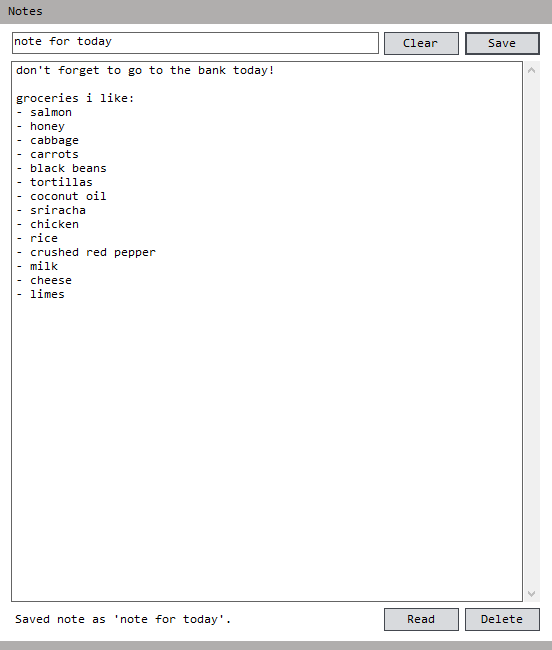
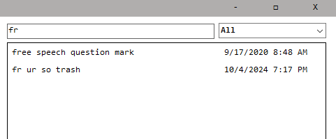
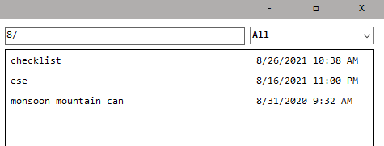
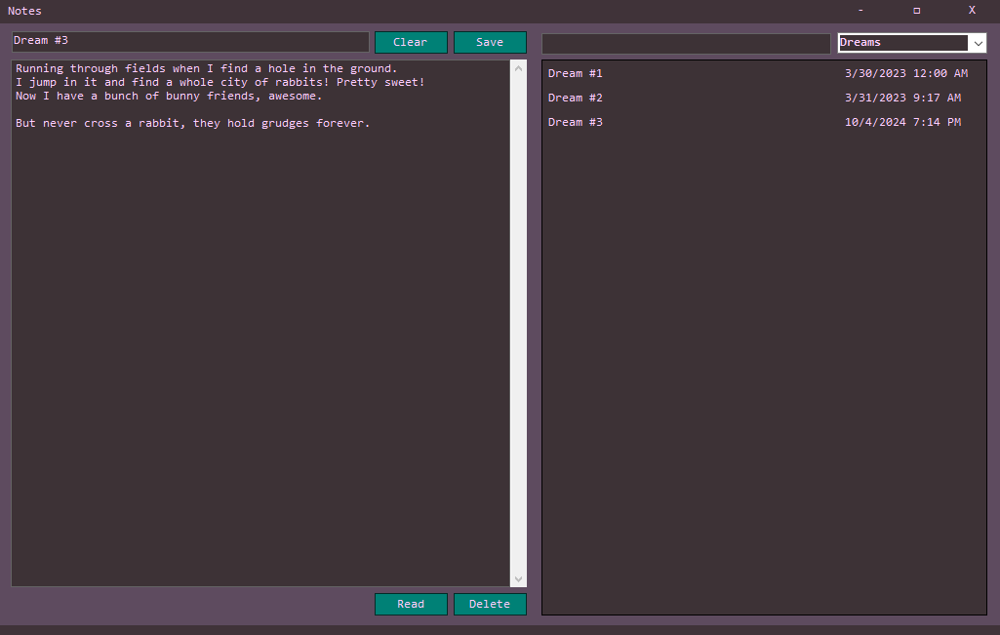

# SPONGE'S NOTES APP
This is an experimental attempt at a note-taking application made using Windows Forms.
It is fully functional, albeit a bit rough around the edges.
## WRITING PANEL
Write a title (and some content), then save it by pressing the button or using `ctrl`+`s`. 
Includes a `clear`, `save`, `delete`, and `read` button.
## SIDEBAR
Double-click on entries or click them and press the `read` button to open them in the writing panel.
Includes a robust search bar, able to search by title and last date edited.
The drop-down list acts as a folder system. Change the text in the drop-down list when saving a file and a new folder will be created.
## FEATURES
- Write a title and body for your note
- Save your note utilizing a binary serialization algorithm
- Three unique views to interact with the UI
- Easy-to-read list view of all saved notes
- Status messages in the bottom left to indicate certain things
- Timestamp notes based on when they were last modified
- Double-click on notes in the list to access them
- Clear your writing space
- Drag the bottom tab to resize the program vertically
- Unique categories per note
- View notes based on their category
- Search for notes by title or date last modified
- Popups to check if you mean to overwrite files
- A color customization menu
- Settings menu
## SECRET SETTINGS
Hold `ctrl` while clicking on the maximize button. This will open up a settings panel.
You can customize the colors of the application here and toggle some settings.
## BUGS
This is an old project, and I am aware of some bugs/features not yet implemented.
- content inside the window is weird on resolutions not equal to 1920x1080
- flickering when customizing colors
- `read` button does jack

## SCREENSHOTS

